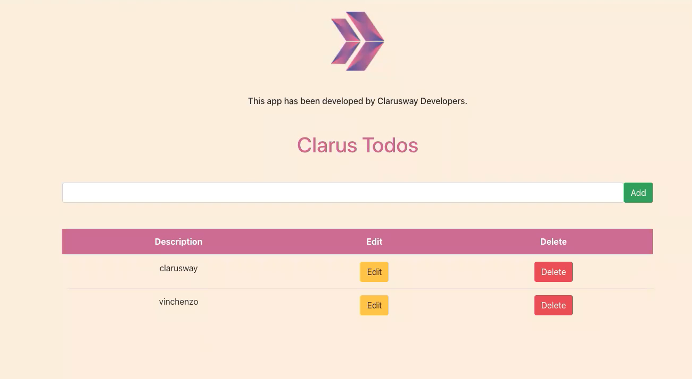

# Jenkins Pipeline for Web Page Application (Postgresql-Nodejs-React) deployed on EC2

## Description

A Jenkins pipeline is created to deploy a web application using Node.js and React frameworks on AWS. The infrastructure is managed with Ansible, and the setup includes one Jenkins server hosted on an EC2 instance. The application consists of three main components: PostgreSQL as the database, Node.js for the backend, and React for the frontend. Each component runs in its own Docker container on dedicated EC2 instances. Docker images for PostgreSQL, Node.js, and React are built on the Jenkins server and pushed to AWS ECR. Ansible automates the deployment of these containers and configures security groups to allow necessary traffic. Terraform is used to build the infrastructure, and the Jenkins pipeline handles the entire deployment process, including error handling to clean up resources if needed.

This infrastructure has 1 jenkins server (`Amazon Linux 2023 AMI`) as ansible control node and 3 EC2's as worker node (`Red Hat Enterprise Linux 9 with High Availability`). Web-page has 3 main components which are postgresql, nodejs, and react. Each component is serving in Docker container on EC2s dedicated for them. Postgresql is serving as Database of web-page. Nodejs controls backend part of web-side and react controls frontend side of web-page. 

The code was written by Clarusway's Developers and architecture will be created by Clarusway's AWS & DevOps Team.

## Problem Statement


- Application is coded by Clarusway Fullstack development team and given you as DevOps team. Web-page allows users to collect their infos. Registration data should be kept in separate PostgreSQL database located in one of EC2s. Nodejs framework controls backend and serves on port 5000, it is als connected to the PostgreSQL database on port 5432. React framework controls the frontend and it is also connected to the Nodejs server on port 5000. React server broadcasts web-page on port 3000. 

- The Web Application will be deployed using Nodejs and React framework.

- The Web Application should be accessible via web browser from anywhere on port 3000.

- EC2's and their security groups should be created on AWS console with Terraform.

- The rest of the process has to be controlled with control node which is connected SSH port.

- Codes written by Clarusway developers should be pulled from Clarusway Repo into the Jenkins server and sent them to the EC2's from here with Ansible.

- Postgresql, Nodejs and React parts has to be placed in docker container. 

- Your project manager wants the DevOps team to launch an EC2 for each postgresql, nodejs and react docker container. In addition, he asks to write one playbook for this project to install and configure docker and create containers in each instances.

- You are also requested; to use AWS ECR as image repository, to create Docker Containers with 3 managed nodes (postgresql, nodejs and react EC2 instances).

In the architecture, you can configure your architecture with these conditions,

  - Create a new `private` repository for the project on GitHub.

  - All process has to be controlled into the `jenkins server` as control node.

  - Dynamic inventory (`inventory_aws_ec2.yml`) has to be used for inventory file.

  - Ansible config file (`ansible.cfg`) has to be placed in jenkins server.
  
  - Docker should be installed in all worker nodes using ansible.

  - Docker images should be build in jenkins server and pushed to the AWS ECR.

  - `for_devops_files` file should be pulled from Github Repo at the beginning. Then these files should be copy to related folders.

- For PostgreSQL worker node

    - Docker image should be created for PostgreSQL container with `dockerfile-postgresql` and `init.sql` file should be placed under necessary folder.

    - Docker images should be build in jenkins server from `dockerfile-postgresql` and pushed to the AWS ECR.

    - Create PostgreSQL container in the worker node. Do not forget to set password as environmental variable.

    - Please make sure this instance's security group should be accept traffic from PostgreSQL's dedicated port from Nodejs EC2 and port 22 from anywhere.

    - To keep database's data, volume has to be created with docker container and necessary file(s) should be kept under this file.

  - For Nodejs worker node

    - Please make sure to correct or create `.env` file under `server` folder based on PostgreSQL environmental variables. To automize taking private ip of postgresql instance you can use linux `envsubst` command with env-template.
    
    - Docker image should be created for nodejs container with dockerfile-nodejs and `server` files should be placed under necessary folder. This file will use for docker image. You don't need any extra file for creating Nodejs image.

    - Docker image should be built for Nodejs container in jenkins server from `dockerfile-nodejs` and pushed to the AWS ECR.

    - Create Nodejs container in nodejs instance with ansible and publish it on port 5000.

    - Please make sure this instance's security group should be accept traffic from 5000, 22 dedicated port from anywhere.

  - For React worker node

    - Please make sure to correct `.env` file under `client` folder based on Nodejs environmental variables. To automize taking public ip of nodejs instance, you can use linux `envsubst` command with env-template.
    
    - Docker image should be created for react container with dockerfile-react and `client` files should be placed under necessary folder. This file will be used for docker image. You don't need any extra file for creating react image.

    - Docker image should be built for React container in jenkins server from `dockerfile-react` and pushed to the AWS ECR.

    - Create React container and publish it on port 3000.

    - Please make sure this instance's security group should be accept traffic from 3000, and 80 dedicated port from anywhere.


  - To use the AWS ECR as image repository;

    - Enable the instances with IAM Role allowing them to work with ECR repos using the instance profile.

    - Install AWS CLI `Version 2` on worker node instances to use `aws ecr` commands.

- To create a Jenkins Pipeline, you need to launch a Jenkins Server with security group allowing SSH (port 22) and HTTP (ports 80, 8080) connections. For this purpose, you can use pre-configured [*Terraform configuration file for Jenkins Server enabled with Git, Docker, Terraform, Ansible and also configured to work with AWS ECR using IAM role*](./jenkins_server/install-jenkins.tf).

- Create a Jenkins Pipeline with following configuration;

  - Build the infrastructure for the app on EC2 instances using Terraform configuration file.

  - Create an image repository on ECR for the app.

  - Build the application Docker image and push it to the same ECR repository with different tags.

  - Deploy the application on AWS EC2's with ansible.

  - Make a failure stage and ensure to destroy infrastructure, ECR repo and docker images when the pipeline failed.

## Project Skeleton

```bash
my-jenkins-pipeline (folder)
|
|----Readme.md                  # Given (Definition of the project)
|----dockerfile-postgresql      # Given 
|----dockerfile-nodejs          # Given 
|----dockerfile-react           # Given 
|----main.tf                    # To be delivered by (for managed nodes)
|----Jenkinsfile                # To be delivered by
|----Ansible-Playbook           # To be delivered by
|----for_devops_files (folder)     # Given  (Postgresql, Nodejs and React files)
|       1.server (folder) ---> Nodejs folders and files
|       2.client (folder) ---> React folders and files
|       3.database (folder)--> init.sql file 
|----ansible.cfg                # Given
|----inventory_aws_ec2.yml      # Given
|----install-jenkins.tf         # Given (Terraform template for Jenkins Server)
|----variables.tf               # Given (Terraform template for Jenkins Server)
|----jenkins.sh                 # Given (Terraform template for Jenkins Server)
|----node-env-template          # Given (env template to take prostgresql node private ip)
|----react-env-template         # Given (env template to take nodejs node private ip)

```

## Expected Outcome



### At the end of the project, following topics are to be covered;

- Jenkins Pipeline Configuration

- Create infrastructure with Terraform

- Deploy the application with Ansible

- Ansible playbook preparation

- Docker image creation for postgresql, nodejs and react containers

- Docker container launching using created image with ansible playbook

- Bash scripting

- AWS ECR as Image Repository

- AWS IAM Policy and Role Configuration

- AWS EC2 Launch Template Configuration

- AWS EC2 Configuration

- AWS EC2 Security Group Configuration

- Git & Github for Version Control System

### At the end of the project will be able to;

- demonstrate how to configure Jenkins pipeline to create infrstructure with terraform.

- demonstrate how to configure Jenkins pipeline to deploy app with ansible.

- demonstrate how to configure Dockerfile.

- set up 3 containers to work with AWS ECR for pulling docker images.

- deploy an application with ansible.

- create and configure AWS ECR from the AWS CLI.

- use Docker commands effectively to tag, push, and pull images to/from ECR.

- demonstrate bash scripting skills using `user data` section in terraform to install and setup environment for ansible manged nodes.

- demonstrate their configuration skills of AWS EC2, IAM Policy, Role, Instance Profile, and Security Group.

- apply git commands (push, pull, commit, add etc.) and Github as Version Control System.

## Resources

- [Ansible Documentation Framework](https://docs.ansible.com/ansible/2.5/user_guide/index.html)

- [AWS CLI Command Reference](https://docs.aws.amazon.com/cli/latest/index.html)

- [Authenticating Amazon ECR Repositories for Docker CLI with Credential Helper](https://aws.amazon.com/blogs/compute/authenticating-amazon-ecr-repositories-for-docker-cli-with-credential-helper/)

- [Docker Reference Page](https://docs.docker.com/reference/)

- [Jenkins Handbook](https://www.jenkins.io/doc/book/)
